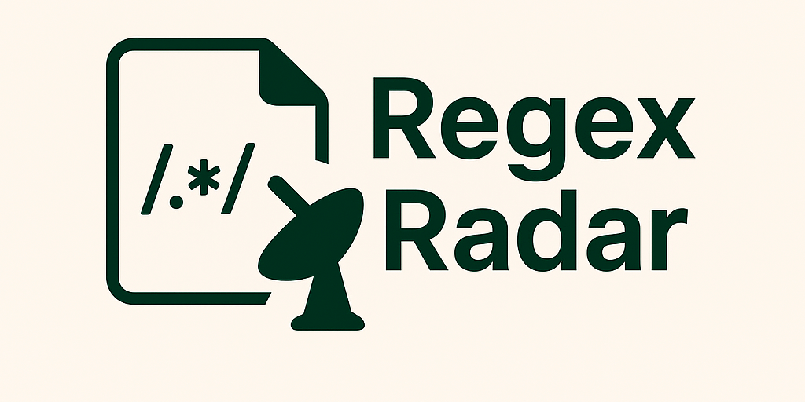
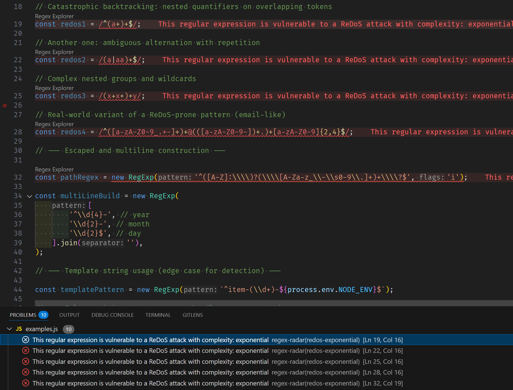
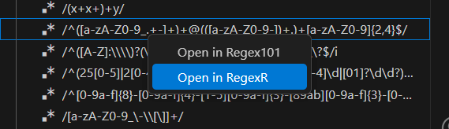
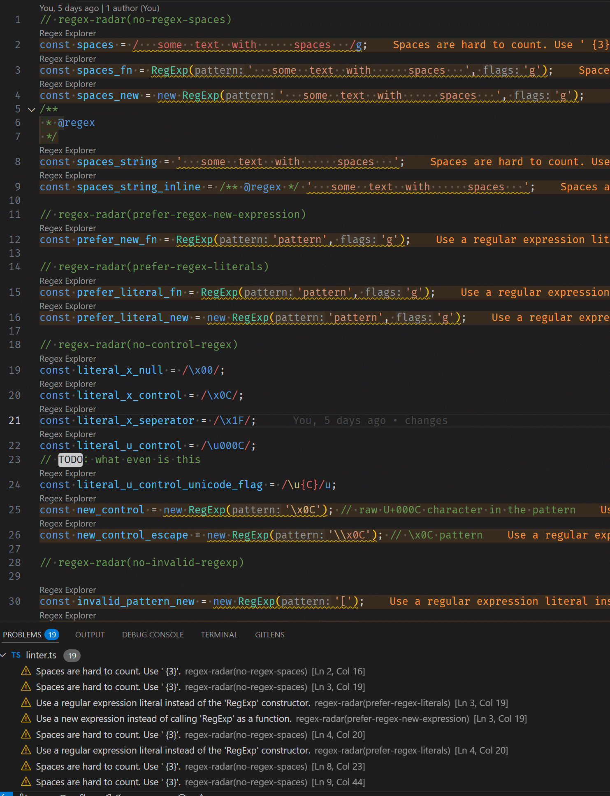
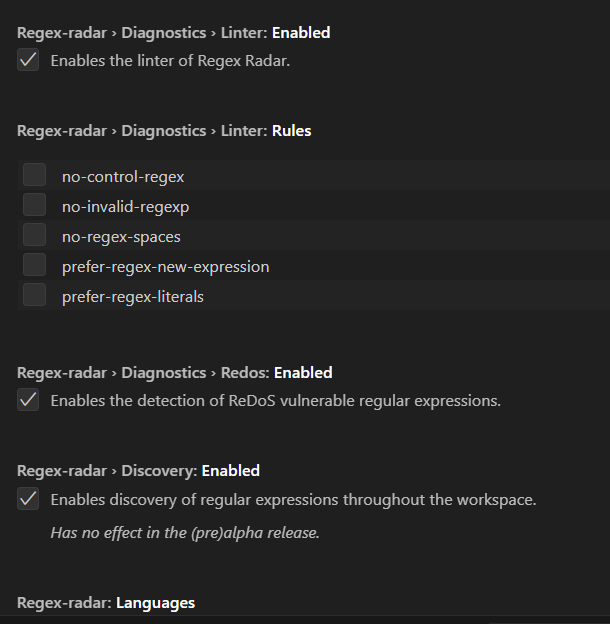

# Regex Radar

A Language Server-powered toolkit for developing, testing, and maintaining regular expressions inside VS Code and beyond.
It provides instant visibility across your regex patterns, enables safe testing, and is built with an extensible architecture that can support other editors and future CLI workflows.

- Lists all regex patterns across your workspace in a structured explorer
- Highlights unsafe or performance-heavy regexes (including ReDoS risks)
- Runs analysis incrementally to stay fast and avoid UI interruptions
- Opens regexes directly in external tools like RegExr and Regex101
- Provides linting and maintainability insights for complex expressions
- Fully configurable behavior and rules to match your workflow

> [!NOTE]
> Regex Radar is in (pre)alpha. Features and behavior are still evolving as the core foundation is built toward the first stable release.

## Features

### Dynamic discovery of regular expressions across your workspace, presented in a clear and structured view.

Regex Radar indexes both literal `/.../flags` patterns and `new RegExp(...)` constructors. View them in a structured tree panel to understand how patterns are used across your codebase.

### Detects unsafe & vulnerable regular expressions, including patterns susceptible to ReDoS.

Powered by the [recheck](https://makenowjust-labs.github.io/recheck/) ReDoS checker, Regex Radar identifies patterns that may lead to catastrophic backtracking or performance issues. Suspicious patterns surface through diagnostics for early review.

### Designed for performance and a seamless developer experience. The extension operates without blocking or interrupting your normal workflow.

Regex Radar performs analysis incrementally without blocking the UI, keeping editor performance smooth even in large projects.

### Open regular expressions directly in external tools like RegExr and Regex101

Quick commands let you open any pattern directly in [RegExr](https://regexr.com/) or [Regex101](https://regex101.com/) for testing, visualization or debugging workflows.

### Integrated linting and analysis to detect confusing, overly complex or unnecessarily repetitive patterns.

Highlight patterns that are unclear, overly complex, ambiguous or difficult to maintain. Surface insights that improve long-term readability.

### Fully configurable behavior and analysis rules, allowing you to enable only the parts you value.

Enable or disable analysis behaviors to fine-tune the extension to your development style and environment.

## Installation

Available on the VS Code Marketplace as [Regex Radar](https://marketplace.visualstudio.com/items?itemName=regex-radar.regex-radar) or in your VS Code editor in the Extensions panel as "Regex Radar".

> [!WARNING]
> Currently released `0.1.x` versions are considered (pre-)alpha releases and not guarrenteed to work without issues.

## Getting Started

1. Install the extension
2. Linter and ReDoS checking will run in the background, diagnostics will be shown in the VS Code interface.
3. Open the Regex Explorer pane in the Explorer panel or use the Regex Explorer panel. (screenshots to follow).
4. Click on a regular expression to find it in your source code.
5. Use the context menu (right click) to open the regex in an external tool.

## How it works

Regex Radar is composed of two parts:

- **Client Extension (VS Code):** Displays the Regex Explorer UI, handles navigation and commands.
- **Language Server:** Analyzes source files, extracts regex patterns, performs diagnostics and provides data back to the client.

The Language Server architecture allows the same backend logic to be shared with other IDEs or tooling environments.

## FAQ

### Is this more AI slop?

**No**, this is not one of those AI-generated extensions.

All code, architecture, and design decisions are written and maintained by a human. AI was only used where it's actually effective: brainstorming ideas, organizing milestones, and tightening documentation. The implementation itself is fully human.

Regex tooling requires sustained reasoning about parsing, correctness, performance and editor workflows. Current AI tools do not produce maintainable codebases in this domain.

### What does "Language Server-powered" mean and why does it matter?

Regex Radar runs heavy tasks in a separate process, the **language server**, so VS Code stays
responsive and fast. The language server handles analysis independently of the editor.

It also allows other IDEs or tools to use the same engine via the
[Language Server Protocol](https://microsoft.github.io/language-server-protocol/).

### Does this only support JavaScript/TypeScript?

Yes, currently only JavaScript and TypeScript are supported.
The core engine is language-agnostic, so adding other languages is relatively easy and planned for future releases.

### Can I disable the linter?

Yes. All rules can be toggled individually, or the linter can be turned off entirely.
Regex Radar is designed to **complement**, not replace, other tools like ESLint.
If you already use ESLint with rules that check regexes, disable overlapping rules to avoid duplication.

## Roadmap

### 1. Reach the MVP baseline

- [ ] Complete the initial [MVP Release](https://github.com/kevinramharak/regex-radar/issues/6)
- [ ] Stabilize core regex discovery and navigation
- [ ] Confirm ReDoS detection behavior and diagnostics messaging

### 2. Improve regex understanding and visualization

- [ ] Inline hover explanations with structural breakdowns
- [ ] Example string testing inside a preview editor with match and capture group highlighting
- [ ] Visual breakdown of vulnerable patterns (heatmaps, worst-case match traces)

### 3. Guidance, refactoring and maintainability

- [ ] Complexity scoring for quick assessment
- [ ] Suggestions to simplify, rewrite or refactor patterns
- [ ] Code actions to fix common readability and performance issues

### 4. Performance and validation workflows

- [ ] Optional benchmarking mode to measure pattern execution cost
- [ ] Workspace-wide regex audit summaries and reports

### 5. Platform and environment expansion

- [ ] Additional language support using extensible grammar backends
- [ ] Optional CLI tool for CI pipelines, audits and code review automation
- [ ] Reuse the Language Server in other editors (Neovim, JetBrains, etc.)

## Contributing

The documentation for contributing will be updated soon as part of the initial full release.

## License

Licenced under [MIT](./LICENSE).
